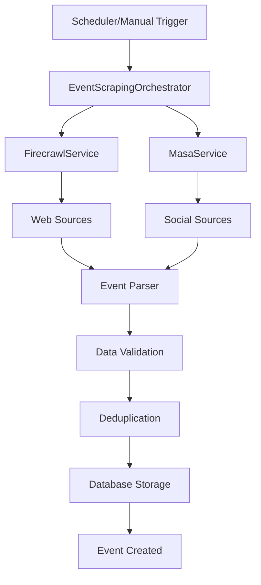

# 🕷️ MegaVibe Event Scraping System

A robust, scalable web scraping system that automatically collects Web3 event data from multiple sources using Firecrawl and Masa APIs.

## 🚀 Features

- **Multi-Source Scraping**: Web scraping (Firecrawl) + Social media (Masa)
- **Automated Scheduling**: Cron-based monthly scraping
- **Rate Limiting**: Built-in rate limiting for API compliance
- **Error Handling**: Comprehensive retry logic and error recovery
- **Real-time Monitoring**: Dashboard for monitoring scraping jobs
- **Data Validation**: Automatic event data validation and deduplication
- **Modular Architecture**: DRY, performant, and organized codebase

## 📋 Prerequisites

- Node.js 18+
- MongoDB database
- Firecrawl API key
- Masa API key

## ⚙️ Configuration

### Environment Variables

Add these to your `.env` file:

```bash
# Web Scraping APIs
FIRECRAWL_API_KEY=fc-a0045fd1f62e4dcabcf13b2a59181747
MASA_API_KEY=9Ta5FIKIRXk4KajhhBQlT62ERui6znTc5DZY9qxBfpq3fEuj

# Scraping Configuration
SCRAPING_ENABLED=true
SCRAPING_SCHEDULE=0 0 1 * *
SCRAPING_MAX_CONCURRENT=5
SCRAPING_TIMEOUT=30000
SCRAPING_RETRY_ATTEMPTS=3
```

### Install Dependencies

```bash
cd megavibe/backend
npm install node-cron node-fetch
```

## 🏗️ Architecture

### Core Components

```
services/scraping/
├── ScrapingConfig.cjs          # Centralized configuration
├── BaseScrapingService.cjs     # Base class with common functionality
├── FirecrawlService.cjs        # Firecrawl API implementation
├── MasaService.cjs            # Masa API implementation
└── EventScrapingOrchestrator.cjs # Main orchestrator
```

### Data Sources

**Web Sources (Firecrawl)**:
- GoWeb3.fyi - Web3 events listing
- OnChain.org - Blockchain conferences
- Lu.ma/crypto - Crypto meetups

**Social Sources (Masa)**:
- Twitter - Web3 event announcements
- Real-time social media monitoring

## 🎮 Usage

### Manual Scraping

```bash
# Run full scraping job
npm run scrape

# Test scraping services
npm run scrape:test
```

### API Endpoints

```bash
# Get scraping status
GET /api/scraping/status

# Trigger manual scraping
POST /api/scraping/trigger

# Stop current job
POST /api/scraping/stop

# Test services
POST /api/scraping/test/firecrawl
POST /api/scraping/test/masa

# Health check
GET /api/scraping/health
```

### Frontend Dashboard

Access the scraping dashboard at `/admin/scraping` to:
- Monitor active scraping jobs
- View statistics and performance metrics
- Trigger manual scraping
- Test individual services
- View configuration

## 📊 Data Flow



## 🔧 Service Details

### FirecrawlService

**Capabilities**:
- Single URL scraping
- Batch scraping (multiple URLs)
- Website crawling (discover pages)
- Content parsing (markdown + HTML)

**Rate Limits**:
- 60 requests/minute
- 1000 requests/hour

**Example Usage**:
```javascript
const firecrawl = new FirecrawlService();
const result = await firecrawl.scrape('https://goweb3.fyi/');
const events = await firecrawl.parseEventData(result, source);
```

### MasaService

**Capabilities**:
- Twitter event search
- Real-time social monitoring
- Engagement metrics
- Event extraction from tweets

**Rate Limits**:
- 3 requests/second
- 180 requests/minute

**Example Usage**:
```javascript
const masa = new MasaService();
const events = await masa.searchTwitterEvents([
  'web3 conference 2024',
  'ethereum event devcon'
]);
```

## 📈 Monitoring & Analytics

### Key Metrics

- **Events Found**: Total events discovered
- **Events Created**: Successfully saved events
- **Success Rate**: API request success percentage
- **Error Rate**: Failed requests and parsing errors
- **Performance**: Requests per second, response times

### Dashboard Features

- Real-time job progress
- Service health monitoring
- Error tracking and reporting
- Configuration management
- Historical statistics

## 🛠️ Development

### Adding New Sources

1. **Web Source**:
```javascript
// Add to ScrapingConfig.cjs
{
  name: 'New Source',
  url: 'https://example.com/events',
  type: 'events_listing',
  selectors: {
    events: '.event-card',
    title: 'h2',
    date: '.date',
    location: '.location'
  }
}
```

2. **Social Source**:
```javascript
// Add to ScrapingConfig.cjs
{
  name: 'New Platform',
  platform: 'twitter',
  queries: ['new search terms']
}
```

### Custom Event Parsing

Extend the parsing logic in `FirecrawlService.parseEventData()` or `MasaService.parseTwitterEvents()`:

```javascript
parseCustomEventData(rawData, source) {
  // Custom parsing logic
  return events.map(event => ({
    name: this.cleanText(event.title),
    date: this.parseDate(event.dateString),
    location: this.extractLocation(event.venue),
    // ... other fields
  }));
}
```

## 🔒 Security & Best Practices

### API Key Management
- Store keys in environment variables
- Never commit keys to version control
- Rotate keys regularly

### Rate Limiting
- Built-in rate limiting for all services
- Exponential backoff on failures
- Respect API provider limits

### Data Validation
- Validate all scraped data before storage
- Sanitize text content
- Check for required fields

### Error Handling
- Comprehensive try-catch blocks
- Graceful degradation on service failures
- Detailed error logging

## 📅 Scheduling

### Cron Schedule Format
```bash
# Monthly on 1st at midnight
SCRAPING_SCHEDULE=0 0 1 * *

# Weekly on Sunday at 2 AM
SCRAPING_SCHEDULE=0 2 * * 0

# Daily at 6 AM
SCRAPING_SCHEDULE=0 6 * * *
```

### Manual Scheduling
```javascript
const orchestrator = new EventScrapingOrchestrator();
await orchestrator.runFullScraping();
```

## 🚨 Troubleshooting

### Common Issues

**1. API Key Errors**
```bash
Error: FIRECRAWL_API_KEY environment variable is required
```
Solution: Add API keys to `.env` file

**2. Rate Limiting**
```bash
Rate limited firecrawl, waiting 60000ms
```
Solution: Normal behavior, system will wait and retry

**3. Parsing Errors**
```bash
Unable to parse date: "Invalid Date"
```
Solution: Check source website structure changes

**4. Database Connection**
```bash
MongooseError: Connection failed
```
Solution: Verify MONGO_URI and database accessibility

### Debug Mode

Enable detailed logging:
```bash
NODE_ENV=development npm run scrape
```

### Health Check

Test all services:
```bash
curl http://localhost:3000/api/scraping/health
```

## 📚 API Reference

### Status Response
```json
{
  "success": true,
  "data": {
    "isRunning": false,
    "currentJob": null,
    "stats": {
      "totalRuns": 5,
      "eventsFound": 127,
      "eventsCreated": 89,
      "errors": 3
    },
    "services": {
      "firecrawl": {
        "requests": 15,
        "successes": 14,
        "failures": 1,
        "successRate": 93.3
      }
    }
  }
}
```

### Trigger Response
```json
{
  "success": true,
  "message": "Scraping job started",
  "jobId": "scraping_1703123456789"
}
```

## 🎯 Future Enhancements

- [ ] **Speaker Profile Enhancement**: Auto-populate from social profiles
- [ ] **Event Categorization**: ML-based event type classification
- [ ] **Duplicate Detection**: Advanced similarity matching
- [ ] **Real-time Notifications**: Slack/Discord integration
- [ ] **Data Export**: CSV/JSON export functionality
- [ ] **Analytics Dashboard**: Advanced metrics and insights
- [ ] **API Webhooks**: Real-time event notifications
- [ ] **Multi-language Support**: International event sources

## 📄 License

This scraping system is part of the MegaVibe platform and follows the same license terms.

---

**Built with ❤️ for the Web3 community**